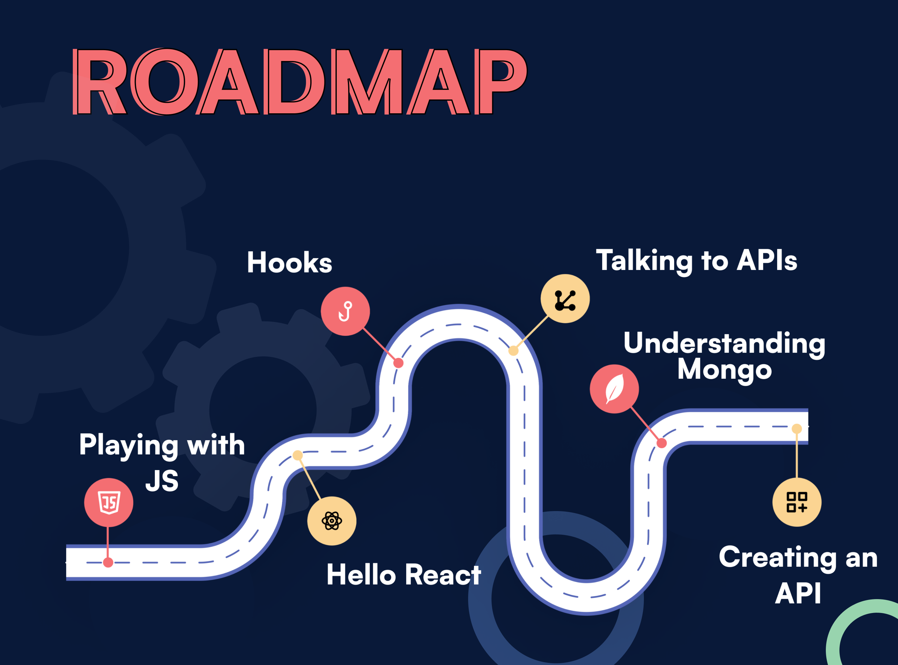

# Web Developement Bootcamp  

# Resources

* [Basic HTML and CSS](https://www.freecodecamp.org/learn/responsive-web-design/)
* [Javascript Fundamentals](https://youtu.be/w-VeNiSF_bo)
* [Git basics](https://youtu.be/_iWGbWs7cp0)